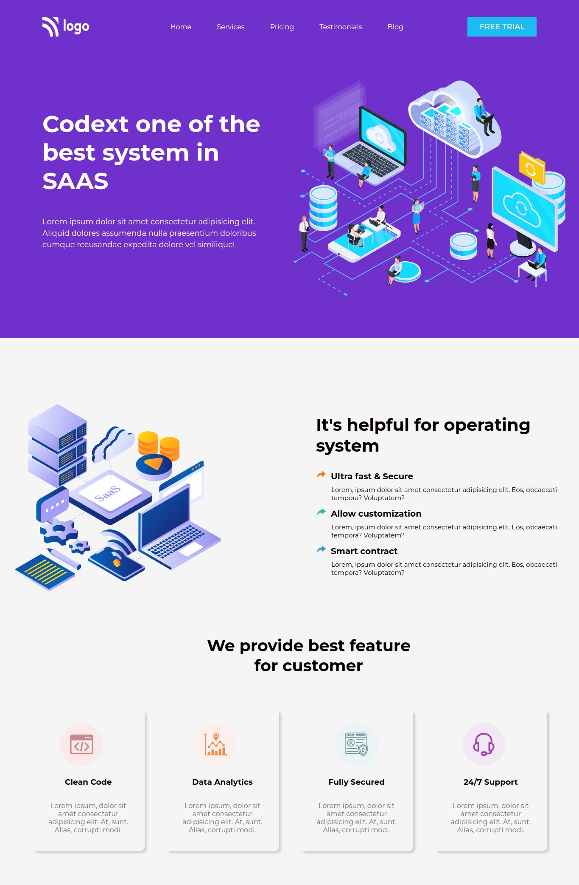
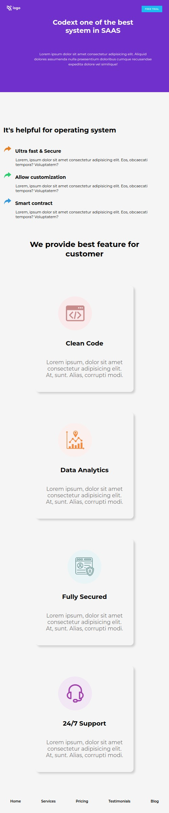

# Assignment 13
12th August 2022
## Full Stack Javascript Web Development Course by [iNeuron](https://ineuron.ai/)

This webpage is created with core HTML and CSS only. It is not responsive. I have used only media query make it mobile responsive. It took me almost 4 to 5 hours to complete this project.This project helped me to learn planning for designing web page, editing svg images, using media query. Images and icons are collected from [icons8](https://icons8.com/) and [iNeuron](https://ineuron.ai/) and [Boxy svg](https://boxy-svg.com/app) for editing svg images.

[Click Here](https://fsjs-assignment13.netlify.app/) to view the website.

## Screenshot of the full web-page in normal laptop screen:

## Screenshot of the full web-page in smaller screen:

## Contact me: [Linkedin](https://www.linkedin.com/in/subham-dutta-8670b8178/) | [Github](https://github.com/Sduttt) | [Twitter](https://twitter.com/Subhamd88404337) | [Facebook](https://www.facebook.com/profile.php?id=100073951804006) | [Instagram](https://www.instagram.com/its_subham_dutta/)

## Find me on [Findcoder.io](https://www.findcoder.io/u/sdutta)